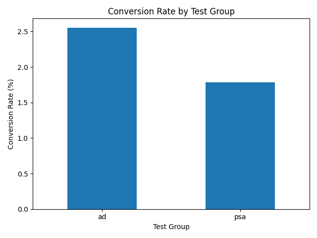

# 📊 A/B Testing & Experiment Analysis: Ads vs PSA

## 🧠 Business Problem

A company wants to determine whether showing ads to users leads to higher conversion rates compared to showing a public service announcement (PSA).

---

## 🎯 Objective

Evaluate if the **ad version (treatment group)** significantly improves user conversion compared to the **PSA version (control group)**.

---

## 🧪 Experiment Setup

* **Control Group:** PSA (no ad)
* **Treatment Group:** Ads shown to users
* **Metric:** Conversion Rate
  [
  Conversion\ Rate = \frac{Conversions}{Total\ Users}
  ]

---

## 🔍 Hypothesis

* **Null Hypothesis (H₀):**
  Conversion rate (Ad) = Conversion rate (PSA)

* **Alternative Hypothesis (H₁):**
  Conversion rate (Ad) > Conversion rate (PSA)

---

## 📈 Data Overview

The dataset contains user-level experiment data with the following key columns:

* `user id` – Unique identifier for each user
* `test group` – Indicates Control (PSA) or Treatment (Ad)
* `converted` – Whether the user converted (1 = Yes, 0 = No)
* `total ads` – Number of ads seen
* `most ads day` – Day with highest ad exposure
* `most ads hour` – Hour with highest ad exposure

---

## 📊 Conversion Rate Comparison

| Group           | Total Users | Conversions | Conversion Rate |
| --------------- | ----------- | ----------- | --------------- |
| PSA (Control)   | 23524       | 420         |0.025547         |
| Ads (Treatment) | 564577      | 14423       |0.025547         |


---

## 📉 Visualization



---

## 🧮 Statistical Test

A **Two-Proportion Z-Test** was performed to compare conversion rates.

* **Z-statistic:** 7.37
* **P-value:** 1.70e-13
* **Significance Level (α):** 0.05

---

## ✅ Results

Since the p-value is significantly less than 0.05, we:

👉 **Reject the null hypothesis**

---

## 💡 Business Insight

Users exposed to **ads** have a **significantly higher conversion rate** than users shown a PSA.

The probability that this result occurred by random chance is extremely low.

---

## 🚀 Recommendation

The company should:

👉 **Roll out the ad strategy**, as it demonstrably improves conversions.

---

## 📌 Key Takeaways

* A/B testing enables **data-driven decision making**
* Statistical testing ensures results are **reliable and not due to chance**
* Ads have a **measurable and positive impact** on user behavior

---

## 🛠️ Tools Used

* Python (pandas, numpy)
* matplotlib / seaborn
* statsmodels
* Jupyter Notebook

---

## 📁 Project Structure (Recommended)

```
ab-testing-project/
│
├── data/
│   └── dataset.csv
│
├── notebooks/
│   └── ab_testing_analysis.ipynb
│
├── visuals/
│   └── conversion_rate_by_group.png
│
├── README.md
└── requirements.txt
```
---
Author 
Lawal Olaoluwa, lawalolaoluwa753@gmail.comS